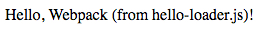

JavaScript Webpack Custom Loader Demo
=====================================

Webpack的loader从概念上讲非常简单，就是一个简单的函数，你把要处理的文本传给它，它会返回处理完的文本。

同时它还可以拿到配置和参数，在这个Demo里未考虑。

```
npm install
npm run demo
```

Then open `index.html`.



Resources
---------

- Writing a Loader: <https://webpack.js.org/contribute/writing-a-loader/>